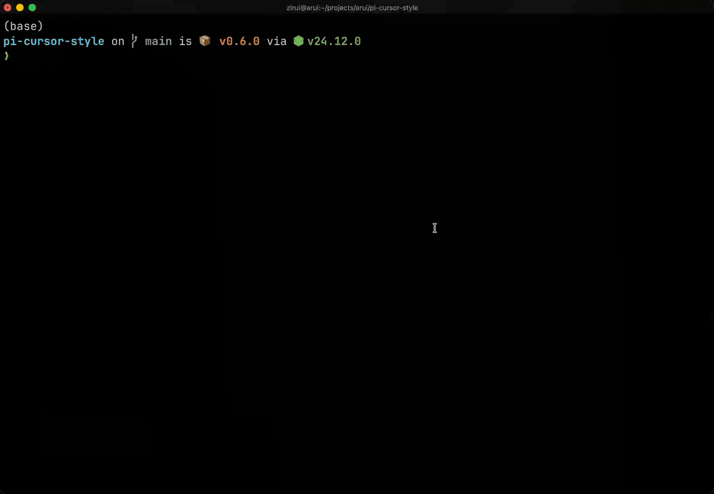

# pi-cursor-style

[English](README.md) | [简体中文](README.zh-CN.md)

自定义 [pi](https://github.com/earendil-works/pi) 输入框光标的外观——颜色、形状，或两者都要。

pi 自带的光标是一个黑白反显块，没有任何设置能改它。这个扩展解决这个问题：

| 样式 | 长这样 | 适合 |
|------|--------|------|
| `block`（默认） | ▮ 盖在当前字符上的色块 | 喜欢默认形状、只想要个颜色 |
| `bar` | ▏ 插在字符**之间**的细竖条 | 轻量标记；文字不被遮挡 |
| `underline` | 字符带下划线 | 低调；字符完整可见 |
| `hardware` | 终端原生光标（如 VS Code 式竖线） | 最原生的手感；字符永不动 |



开箱即用——装好后默认就是蓝色光标，不需要先写任何配置。

## 安装

```bash
pi install git:github.com/Feudalman/pi-cursor-style
```

重启 pi，光标即变为蓝色块。

其他安装方式：

```bash
pi install npm:pi-cursor-style        # npm 发布后可用
```

或手动安装：把 [`extensions/cursor-style.ts`](extensions/cursor-style.ts) 复制到 `~/.pi/agent/extensions/`。

## 日常使用

所有操作都是一条命令：`/cursor-style`。改动**立即生效**——不用重启、不用 reload——并自动保存。

**查看当前配置：**

```
/cursor-style
```

**直接控制终端光标开关**（覆盖"样式即开关"的自动行为）：

```
/cursor-style hardware off     强制关闭 pi 的 showHardwareCursor
/cursor-style hardware on      强制开启（并重新交由扩展自动管理）
```

**换形状：**

```
/cursor-style bar
/cursor-style underline
/cursor-style block
/cursor-style hardware
```

**换颜色：**

```
/cursor-style color #ff5f00        任意 hex 颜色
/cursor-style color 208            xterm 256 色索引
/cursor-style color theme:accent   跟随主题的 accent 色（换主题自动跟随）
/cursor-style color none           不着色，用终端默认前景色
```

完全不设置颜色时，使用内置默认 `#00aaff`（蓝色）。

**各样式行为说明：**

- `block` —— 和默认一样盖住当前字符，但填充你指定的颜色；字符以反转色显示，仍然可读。
- `bar` —— 竖条插在字符**之间**，不遮挡任何文字，也不影响其他行的对齐。极少数情况下行完全占满时，会瞬间回落为默认块以免破坏对齐。
- `underline` —— 给字符画下划线。行尾显示 `▁`，因为多数终端不给空白单元格画下划线。
- `hardware` —— 见下一节，它的工作方式不同。

## `hardware` 样式（VS Code 同款光标）

软件画的光标必须占用一个字符格——这是终端的物理限制。`hardware` 样式绕开了它：**把 pi 画的光标完全隐藏**，让你终端自己的光标（像素级绘制、不占格子）接管。字符永不移动、永不遮挡。

使用方法：

```
/cursor-style hardware
```

**样式即开关**——没有任何弹窗：切到 `hardware` 自动开启 pi 的 `showHardwareCursor`（写入 `~/.pi/agent/settings.json`，立即生效、无需重启）；切到其他样式自动关回去，终端光标不会和软件光标叠加。如果你因为其他原因（如输入法定位）需要常开 `showHardwareCursor`，用 `/cursor-style hardware on` 并保持当前样式即可。

两点须知：

1. **形状和颜色由你终端的光标设置决定**，不是本扩展控制的。想要 VS Code 竖线效果，把终端光标形状设为竖线：
   - VS Code / Cursor 终端：`"terminal.integrated.cursorStyle": "line"`
   - iTerm2：Preferences → Profiles → Text → Cursor → Vertical bar
   - Kitty：`cursor_shape line`
   - Ghostty：`cursor-style = bar`
2. 此模式下 `/cursor-style color ...` **无效**——终端不允许应用给硬件光标上色。

## 用配置文件（可选）

更喜欢直接改文件，或用 dotfiles 管理配置？命令写入的是 `~/.pi/agent/cursor-style.json`，你也可以直接编辑它：

```jsonc
{
	"style": "bar",          // block | bar | underline | hardware
	"color": "#00aaff"       // "#rrggbb" | 0-255 | "theme:<token>" | 省略则用默认蓝色
}
```

直接改文件需要 `/reload` 或重启后生效（命令路径是即时生效）。

## 限制

- 只作用于**主输入框**。`/model`、`/resume` 等内部的小搜索框是 pi 核心构建的，任何扩展都无法修改。
- 扩展靠转义序列（`\x1b[7m…\x1b[0m`）识别 pi 的光标。若未来 pi 版本改变该格式，扩展需要同步更新。
- 其他一切照常：工作状态 spinner、thinking 级别边框色、bash 模式、自动补全、历史记录、中文输入（用于输入法定位的隐形光标标记在所有路径下都被保留）。

## 工作原理（选读）

pi 每帧渲染输入框，光标以反显块画出。本扩展在 `session_start` 时通过 `ctx.ui.setEditorComponent()` 换入一个包装编辑器：先调用 pi 的原始渲染，再按你的样式改写每行中光标的那一小段——着色、插入竖条（宽度借位）、加下划线，或整个移除（hardware 模式）。单元格宽度始终守恒，对齐不会被破坏。

## 兼容性

在 pi `0.86.0` 上验证通过。只使用公开扩展 API。print/RPC 模式下自动跳过。

## 许可证

[MIT](LICENSE)
